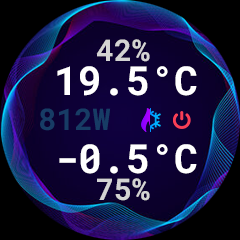

# Home assistant climate on Seeed Studio round screen

This a small project to display some data from Home Assistant on the 1.28 inches round display from Seeed Studio powered by a Xiao ESP32C3.

## Features

- 2 temperatures values
- 2 humidity values
- 2 HVAC modes
- automatically dim screen + touch to wake up
- automatically turn screen off when nobody is at home and during night (between 23h30 and 8h)



## Configuration

### Home assistant

Add a custom binary sensor with the following attributes:
- `time: "{{ states('sensor.time') }}"`
- `at_home: "{{ states('zone.home') | int > 0 }}"`
- `temp_1` & `temp_2` temperature with max one decimal + unit
- `humi_1` & `humi_2` humidity with max one decimal + unit
- `mode_1` & `mode_2` one of `heat`, `cool`, `heat_cool` and `off`

**Example:**
```yaml
template:
  - binary_sensor:
    - name: Data for Xiao
      state: true
      attributes:
        time: "{{ states('sensor.time') }}"
        at_home: "{{ states('zone.home') | int > 0 }}"
        temp_1: "{{ states('sensor.thermometre_sejour_temperature') | round(1) }}°C"
        temp_2: "{{ states('sensor.thermometre_exterieur_temperature') | round(1) }}°C"
        humi_1: "{{ states('sensor.thermometre_sejour_humidity') | round(0) }}%"
        humi_2: "{{ states('sensor.thermometre_exterieur_humidity') | round(0) }}%"
        mode_1: "{{ states('climate.ac_living_room_clim_salon') }}"
        mode_2: "{{ state_attr('climate.chauffage_sejour', 'hvac_action') | replace('heating', 'heat') | replace('idle', 'off') }}"
```

### Firmware

Copy `secrets.tpl.h` into `secrets.h` and fill the values.

- `HA_TOKEN` : go to your HA profile page, then Security, and create a new Long lived token at the bottom of the page (keep the `Bearer ` prefix)
- `HA_URL` : fill in your HA IP and the id of the sensor created above

## Compiling

Needs Visual Studio Code + PlatformIO.  
Run `Upload Filesystem Image` to pack and install the resources then `Upload and Monitor` to compile and install the firmware and check that everything is ok in the serial output.

## 3D printed case

A 3D printable desk case is provided. The screen is secured with a screwable ring.
It requires the usage of a small angled USB-C adapter ([Aliexpress](https://aliexpress.com/item/1005005966745930.html) or [Amazon](https://www.amazon.com/dp/B0B2NJ3P3L)).

The case itself is available in one piece, best for resin printer, or sliced for easier FDM printing (the two slices must be glued together).

 

[Also available on Printables](https://www.printables.com/model/1153601-desk-stand-for-seeed-studio-round-display)

## Links

Generate VLW fonts: https://wiki.seeedstudio.com/Wio-Terminal-LCD-Anti-aliased-Fonts/

Background illustration is not mine but I don't remember where I found it.
